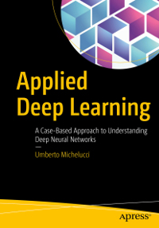

# Applied Deep Learning - A case based approach - Book material

This repository accompanies [*Applied Deep Learning*](https://www.apress.com/9781484237892) by Umberto Michelucci ([Linkedin](https://www.linkedin.com/in/umbertomichelucci/)) (Apress, 2018).

[comment]: #cover

# Videos

You can find videos covering additional advanced material on TOELT youtube channel here

[TOELT Youtube Channel](https://goo.gl/vnWLTL)

## How to use the code
To learn how to use the code plese check the file [HOWTO](https://github.com/Apress/applied-deep-learning/blob/master/HOWTO.md)

## Download the repository

Download the files as a zip using the green button, or clone the repository to your machine using Git.

## Releases

Release v1.0 corresponds to the code in the published book, without corrections or updates.

## Contributions

See the file Contributing.md for more information on how you can contribute to this repository.
